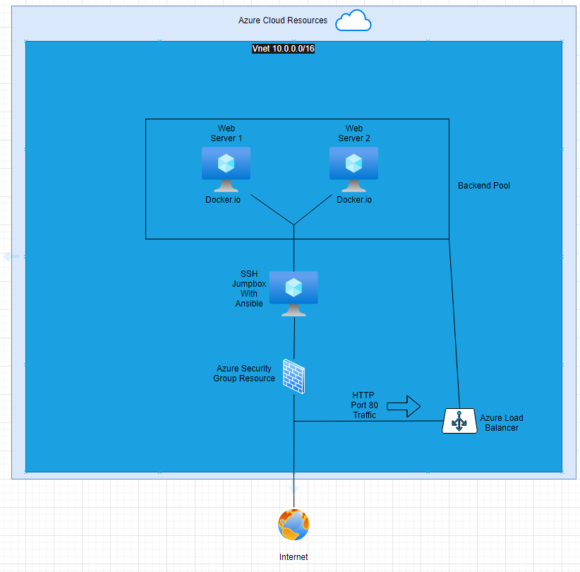
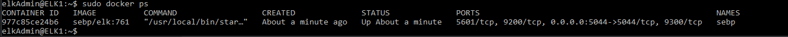

# ProtoProject
Educational submissions and personal testing
## Automated ELK Stack Deployment

The files in this repository were used to configure the network depicted below.

These files have been tested and used to generate a live ELK deployment on Azure. They can be used to either recreate the entire deployment pictured above. Alternatively, select portions of the YAML file may be used to install only certain pieces of it, such as Filebeat.

  -  [Configuring the webservers from the Jump Box Ansible Container](my-playbook.yml)

This document contains the following details:
- Description of the Topology
- Access Policies
- ELK Configuration
  - Beats in Use
  - Machines Being Monitored
- How to Use the Ansible Build

### Description of the Topology

The main purpose of this network is to expose a load-balanced and monitored instance of DVWA, the D*mn Vulnerable Web Application.

Load balancing ensures that the application will be highly available, in addition to restricting direct access to the network.
- The load balancer ensures more availability by forwarding traffic to active servers, allows redundant servers to run in parallel and makes the network more robust.
- The jump box and the load balancer are the only ways to access the servers, reducing the attack surface of the virtual network that the servers exist on.

Integrating an ELK server allows users to easily monitor the vulnerable VMs for changes to the log files and system metrics.
-Filebeat indexes and forwards log files for logstash and elasticsearch use.
-Metricbeat gathers logs about system metrics such as uptime.

The configuration details of each machine may be found below.
_Note: Use the [Markdown Table Generator](http://www.tablesgenerator.com/markdown_tables) to add/remove values from the table_.

| Name     | Function | IP Address | Operating System |
|----------|----------|------------|------------------|
| Jump Box | Gateway  | 10.1.0.4   | Linux            |
| Web1     | Server   | 10.1.0.5   | Linux            |
| Web2     | Server   | 10.1.0.6   | Linux            |
| RedLB    | LBalancer|13.73.32.140| Linux            |

### Access Policies

The machines on the internal network are not exposed to the public Internet. 

Only the Jump Box machine can accept connections from the Internet. Access to this machine is only allowed from the following IP addresses:
- 72.39.46.44

Machines within the network can only be accessed by the Jump Box.
-10.1.0.4

A summary of the access policies in place can be found in the table below.

| Name     | Publicly Accessible | Allowed IP Addresses |
|----------|---------------------|----------------------|
| Jump Box | Yes                 |  72.39.46.44         |
| Web1     | No                  |  10.1.0.4            |
| Web2     | No                  |  10.1.0.4            |

### Elk Configuration

Ansible was used to automate configuration of the ELK machine. No configuration was performed manually, which is advantageous because...
-Configuration can be done remotely and repeatedly across many machines (if needed). This improves the scalable efficiency of deploying these changes.

The playbook implements the following tasks:
- _TODO: In 3-5 bullets, explain the steps of the ELK installation play. E.g., install Docker; download image; etc._
- ...
- ...

The following screenshot displays the result of running `docker ps` after successfully configuring the ELK instance.

### Target Machines & Beats
This ELK server is configured to monitor the following machines:
- 10.1.0.5
- 10.1.0.6

We have installed the following Beats on these machines:
- Filebeats and Metricbeats

These Beats allow us to collect the following information from each machine:
- Metricbeats collects system information and metrics such as system uptime, which we can use to analyze performance or detect problems in the system.
- Filebeats collects log files, which we can use to measure what files are being requested or changed on the servers. 

### Using the Playbook
In order to use the playbook, you will need to have an Ansible control node already configured. Assuming you have such a control node provisioned: 

SSH into the control node and follow the steps below:
- Copy the YAML file to /etc/ansible.
- Update the hosts file to include the IP addresses of the target machines
- Run the playbook, and navigate to <IP>/setup.php to check that the installation worked as expected.

- The file is my-playbook.yml and it is in the /etc/ansible folder.
- The hosts file contains the IP addresses of the target machines. The addresses are under headers such as [webserver] or [elk] to allow different groups to receive different configurations. These can be used to only apply the beats to the [elk] server.
- <Elk-Public-IP>/app/kibana displays the human-readable data that the elk stack is processing.
